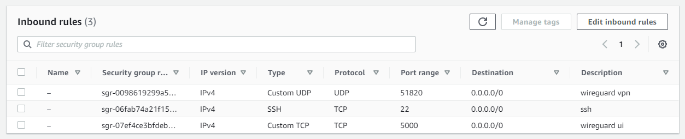

There are several ways to install WireGuard on linux-based server. Two of them are:

- using [wireguard-install](https://github.com/angristan/wireguard-install)
- using [linuxserver/wireguard](https://hub.docker.com/r/linuxserver/wireguard) Docker Image

We are going to learn both approaches in this post.

## 1. WireGuard in a nutshell

WireGuard is an open-source communication protocol that implements encrypted virtual private networks (VPNs) over UDP. It is very easy to use and secure. WireGuard aims to have better performance compared to IPSec and OpenVPN.

## 2. Client application

WireGuard supports many operating systems. Download the installer via the following link:

> https://www.wireguard.com/install/

## 3. WireGuard server setup

### ◉ Using `wireguard-install`

The easiest way to install WireGuard server is via [wireguard-install](https://github.com/angristan/wireguard-install). They provide an executable shell script to automate the installation on some Linux Distro, such as:

- AlmaLinux
- Arch Linux system
- CentOS
- Debian
- Fedora
- Oracle
- Ubuntu

Ok, let us get to the point. To start the installation, run the following command:

```bash
curl -O https://raw.githubusercontent.com/angristan/wireguard-install/master/wireguard-install.sh
chmod +x wireguard-install.sh
./wireguard-install.sh
```

You will be asked to confirm several configurations key. The pre-defined value for each prompt should be sufficient, except for the `IPv4 or IPv6 public address`, for that specific prompt, ensure to have correct public IP address entered.

:::caution

If you are using AWS or another cloud provider, there is a chance that the default IP address value is not the public IP, but the private IP. So please keep in mind, always use the public IP there.

:::

Then the response below will appear:

```log
Welcome to the WireGuard installer!
The git repository is available at: https://github.com/angristan/wireguard-install

I need to ask you a few questions before starting the setup.
You can keep the default options and just press enter if you are ok with them.

IPv4 or IPv6 public address: 11.234.5.181
Public interface: eth0
WireGuard interface name: wg0
Server WireGuard IPv4: 10.66.66.1
Server WireGuard IPv6: fd42:42:42::1
Server WireGuard port [1-65535]: 51820
First DNS resolver to use for the clients: 1.1.1.1
Second DNS resolver to use for the clients (optional): 1.0.0.1

Okay, that was all I needed. We are ready to setup your WireGuard server now.
You will be able to generate a client at the end of the installation.

Press any key to continue...
```

Press enter or any key to continue the installation process. Next, you will be prompted to enter the several configuration for the client.

Feel free to pick any name for `Client name` and let the other fields be filled with the predefined value.

```log
Client configuration

The client name must consist of alphanumeric character(s).
It may also include underscores or dashes and can't exceed 15 chars.

Client name: noval
Client WireGuard IPv4: 10.66.66.2
Client WireGuard IPv6: fd42:42:42::2
```

Keep pressing enter until you see the output below. At this point, the setup is pretty much completed.

```log
Here is your client config file as a QR Code:

...

Your client config file is in /home/ubuntu/wg0-client-noval.conf
If you want to add more clients, you simply need to run this script another time!

WireGuard is running.
You can check the status of WireGuard with: systemctl status wg-quick@wg0

If you don't have internet connectivity from your client, try to reboot the server.
```

From that output you can tell where the client config file is located, it is in `/home/ubuntu/wg0-client-noval.conf`. Save the content on that file somewhere, it will be used on the client side to connect to the WireGuard server.

> For more details, see https://github.com/angristan/wireguard-install

### ◉ Using Docker `linuxserver/wireguard`

The first step is to install Docker engine. Then create the VPN server by starting a new container using `linuxserver/wireguard:latest` using the following command:

- For plain Docker:

  ```bash
  docker run -d \
    --name=wireguard \
    --cap-add=NET_ADMIN \
    --cap-add=SYS_MODULE \
    -e PUID=1000 \
    -e PGID=1000 \
    -e TZ=Asia/Jakarta \
    -e SERVERURL=123.456.78.9 \
    -e SERVERPORT=51820 \
    -e PEERS=1 \
    -e PEERDNS=1.1.1.1 \
    -e INTERNAL_SUBNET=10.13.13.0 \
    -e ALLOWEDIPS=0.0.0.0/0,::/0 \
    -e PERSISTENTKEEPALIVE_PEERS=all \
    -e LOG_CONFS=true \
    -p 51820:51820/udp \
    -v /home/ec2-user/workspace/wireguard/config:/config \
    -v /lib/modules:/lib/modules \
    --sysctl="net.ipv4.conf.all.src_valid_mark=1" \
    --restart unless-stopped \
    lscr.io/linuxserver/wireguard:latest
  ```

- For `docker-compose`:

  ```yaml
  version: '3.7'

  services:
    wireguard:
      image: lscr.io/linuxserver/wireguard:latest
      container_name: wireguard
      cap_add:
        - NET_ADMIN
        - SYS_MODULE
      environment:
        - PUID=1000
        - PGID=1000
        - TZ=Asia/Jakarta
        - SERVERURL=123.456.78.9
        - SERVERPORT=51820
        - PEERS=1
        - PEERDNS=1.1.1.1
        - INTERNAL_SUBNET=10.13.13.0
        - ALLOWEDIPS=0.0.0.0/0,::/0
        - PERSISTENTKEEPALIVE_PEERS=all
        - LOG_CONFS=true
      volumes:
        - /home/ec2-user/workspace/wireguard/config:/config
        - /lib/modules:/lib/modules
      ports:
        - 51820:51820/udp
      sysctls:
        - net.ipv4.conf.all.src_valid_mark=1
      restart: always
  ```

Ensure to adjust the value of `env var` below:

- `PUID` and `PGID` → use command `id <your-linux-username>` to get the correct number
- `TZ` → specify the timezone of your location. example: `Asia/Jakarta` or `Etc/UTC`
- `SERVERURL` → public IP of your linux instance

Not to forget, map the `/config` path within container to the correct path in host. In the example I use `/home/ec2-user/workspace/wireguard/config:/config`.

Create the container, wait for a few seconds, then check the container logs to see the result. Then go to the path where it's pointing to the `/config`. Go to the `peers` folder.

```bash
cd /home/ec2-user/workspace/wireguard/config
cd peer1
cat peer1.conf
```

Save the content on that `peer1.conf` file somewhere, it will be used on the client side to connect to the WireGuard server.

> For more details, see https://github.com/linuxserver/docker-wireguard

### ◉ Whitelist the UDP port

If you are using cloud provider such as AWS where by default not all ports are public, an additional is required, which is whitelisting the inbound traffic directed to the WireGuard port (in this example, it is `51820`). Ensure to select the `UDP` protocol because WireGuard uses `UDP`.


## 4. Connect to WireGuard

The content of the `.conf` file is something like this:

```bash
[Interface]
PrivateKey = YDqQfiR6+VdaS3xqgSWW5CHAxhH0=
Address = 10.66.66.1/32,fd42:42:42::1/128
DNS = 1.1.1.1,1.0.0.1

[Peer]
PublicKey = ByhoL4uTt2QzQb3dsadwereQzQbufXw=
PresharedKey = aJDPFsuKvrE8TQM3RaQykrNP9os3ms=
Endpoint = 123.456.78.9:50194
AllowedIPs = 0.0.0.0/0,::/0
```

Now open up the WireGuard client application, click `Add tunnel`, then locate the `.conf` file. Next, click `activate` to start the VPN peering connection.


## 5. Set Up WireGuard UI

WireGuard UI is useful tools to manage your WireGuard server via friendly user interface. Such as adding user, adding new client, and other type of actions can be done in interactive manner via WireGuard UI.

If you use `linuxserver/wireguard` Docker image on your end, add the `ngoduykhanh/wireguard-ui` image to `docker-compose.yml`, so the content of that file would be like this:

```yaml
version: '3.7'

services:
  wireguard:
    image: lscr.io/linuxserver/wireguard:latest
    container_name: wireguard
    cap_add:
      - NET_ADMIN
      - SYS_MODULE
    environment:
      - PUID=1000
      - PGID=1000
      - TZ=Asia/Jakarta
      - SERVERURL=123.456.78.9
      - SERVERPORT=51820
      - PEERS=1
      - PEERDNS=1.1.1.1
      - INTERNAL_SUBNET=10.13.13.0
      - ALLOWEDIPS=0.0.0.0/0,::/0
      - PERSISTENTKEEPALIVE_PEERS=all
      - LOG_CONFS=true
    volumes:
      - /home/ec2-user/workspace/wireguard/config:/config
      - /lib/modules:/lib/modules
    ports:
      - 5000:5000 # ← whitelist port 5000 for WireGuard UI
      - 51820:51820/udp
    sysctls:
      - net.ipv4.conf.all.src_valid_mark=1
    restart: always

  wireguard-ui:
    image: ngoduykhanh/wireguard-ui:latest
    container_name: wireguard-ui
    depends_on:
      - wireguard
    cap_add:
      - NET_ADMIN
    network_mode: service:wireguard
    environment:
      - SENDGRID_API_KEY
      - EMAIL_FROM_ADDRESS
      - EMAIL_FROM_NAME
      - SESSION_SECRET
      - WGUI_USERNAME=admin
      - WGUI_PASSWORD=admin
      - WG_CONF_TEMPLATE
      - WGUI_MANAGE_START=true
      - WGUI_MANAGE_RESTART=true
    logging:
      driver: json-file
      options:
        max-size: 50m
    volumes:
      - /home/ec2-user/workspace/wireguard/config:/etc/wireguard
      - /home/ec2-user/workspace/wireguard/db:/app/db
```

Re-run the `docker-compose up -d` command, and then access the UI via `http://yourip:5000`. You also need to whitelist the inbound access for port `5000`.

By default, both username and password is set to `admin`. Right after you logged in to the dashboard, do immediately change the password for safety reason. To do that, click `User Settings → Edit → Enter your new password → Save`.

To create a new client/tunnel access, click the `Wireguard Clients → New Client → Fill the info → Submit`.


