This post is a straightforward hands-on tutorial about implementation of Cloudflare Zero Trust on website by using Terraform.

> This approach works only if your application DNS configured on Cloudflare DNS.

## 1. Terraform / OpenTofu installation

Follow [Install Terraform](https://developer.hashicorp.com/terraform/install) guide to get Terraform installed on your local machine. 

> You folks can also use OpenTofu, either is fine.

Once Terraform successfully installed, verify it using `terraform -version` command.

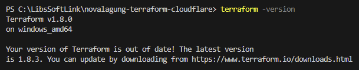

## 2. Cloudflare API token

Login to Cloudflare, then navigate to the [API Token page](https://dash.cloudflare.com/profile/api-tokens), then click `Create Token` → `Edit zone DNS` → `Use Template`.

Ensure to have the following permission attached to your API Token:

- Access: Organizations, Identitiy Providers, and Groups
- Access: Apps and Policies

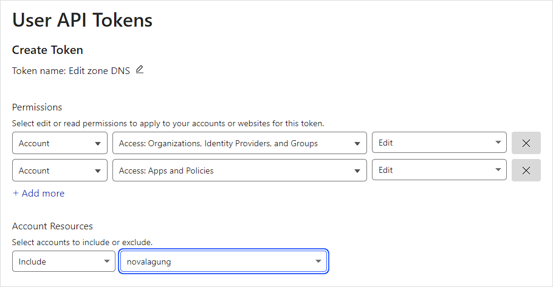

Then click `Continue Summary` → `Create Token`. In the end, you will see the generated API token.

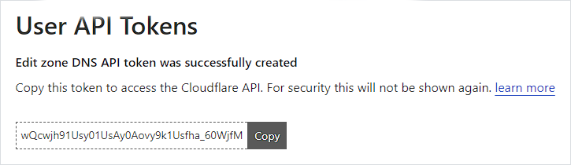

The Cloudflare API token is going to be used on our Terraform (HCL) script for managing Cloudflare Zero Trust configuration programatically.

## 3. Project setup

Let's create a new project for storing the `tf` files. Create a new folder with the following structure:

```bash title="project structure"
my-project
  → provider.cloudflare.tf
  → var.whitelist-access.tf
  → zero-trust.access-group.my-group.tf
  → zero-trust.application.wireguard.tf
```

Next, open `provider.cloudflare.tf` file, fill it with the script below:

```hcl title="File: my-project/provider.cloudflare.tf"
terraform {
  required_providers {
    cloudflare = {
      source  = "cloudflare/cloudflare"
      version = "~> 4.33.0"
    }
  }
}

provider "cloudflare" {
  api_token = "206X7Ba7VwGeLAk93ffUtuMrI_v3vf4xr"
}

variable "account-id" {
  default = "5824f4cbcdf214e05000e217f686bba4"
}
```

Explanation:

- The `terraform` block and everything within is necessary for enabling Cloudflare resource management via Terraform. In the example, Terraform Cloudflare provider `v4.33.0` is being used.

- The `provider "cloudflare"` block must contains the Cloudflare API Token information. Put the API token from [Step 3. Cloudflare API token](/terraform-cloudflare-zero-trust#2-cloudflare-api-token) to the `api_token` variable within that block.

- Put the Cloudflare account ID under `variable "account-id"` block. The account ID information is available on Cloudflare domain summary page, see on the bottom right section.

  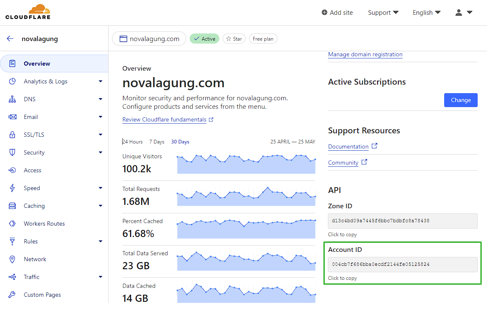

Now, run the following command to initialize the terraform project and to download the Cloudflare provider dependencies:

```bash
cd my-project
terraform init
```

If you see output similar to image below, then all good.

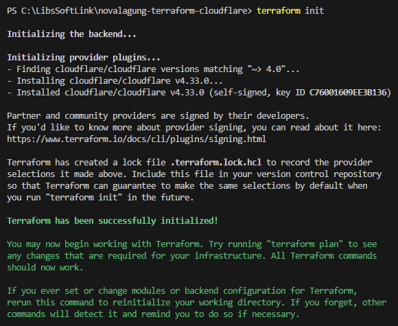

:::info

If you are using Terraform Cloud, ensure to add the `cloud` block under `terraform` block, e.g:

```hcl title="File: my-project/provider.cloudflare.tf"
terraform {
  cloud {
    organization = "novalagung-org"

    workspaces {
      name = "my-workspace-name"
    }
  }

  required_providers {
    cloudflare = {
      source = "cloudflare/cloudflare"
      version = "~> 4"
    }
  }
}
```

:::

As of now, all preparation is completed. Next, we will start to write down the HCL script for managing application, users, and accesses.

## 4. Whitelist access variables

Fill the `var.whitelist-access.tf` file with variable definition for both whitelisted email addresses and email addresses.

```hcl title="File: my-project/var.whitelist-access.tf"
variable "whitelist-email-addresses" {
  default = [
    "hello@novalagung.com",
    "info@novalagung.com"
  ]
}

variable "whitelist-ip-addresses" {
  default = [
    "192.33.44.22/24",
    "12.33.444.23/22"
  ]
}
```

Explanation:

- Variable `whitelist-email-addresses` contains list of email that is allowed to access the target app.
- Variable `whitelist-ip-addresses` contains list of IP address that is allowed to bypass the target app.

## 5. Create Zero Trust access group resource

The email address will not be attached directly to the zero trust policy, instead, it will be added to access group resource. Use the script below for automating the process of creating `my-group` access group resource.

```hcl title="File: my-project/zero-trust.access-group.my-group.tf"
resource "cloudflare_access_group" "my-group" {
  account_id = var.account-id
  name       = "my-group"

  include {
    email = var.whitelist-email-addresses
  }
}
```

Run the `terraform plan` command to validate the resources creation. If no error is visible, continue with `terraform apply` command.

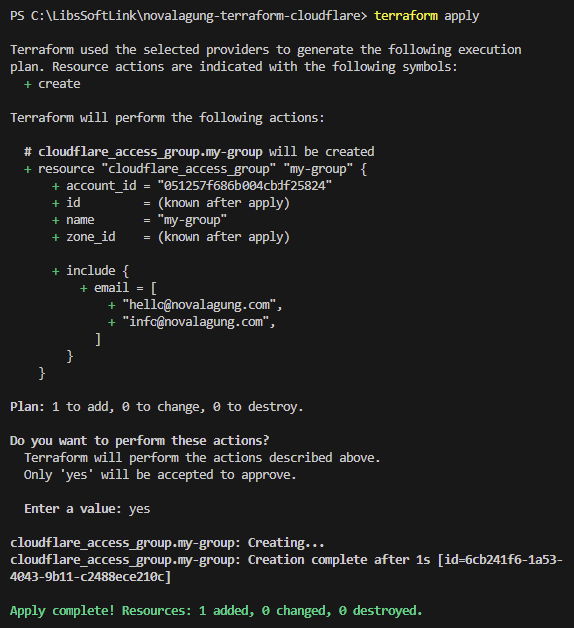

Now open up Cloudflare Zero Trust page. Verify the newly created resource. It should be available under `Access` → `Access Group` → click group name (in my case it is `my-group`).

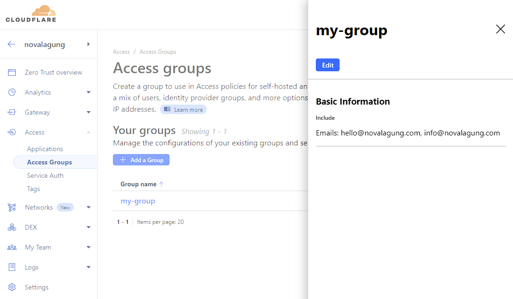

## 6. Create Zero Trust application resource

Let's decide one domain/subdomain as the target for this practice. In my case I'm picking `wireguard.novalagung.com`, it is a WireGuard UI app I created for managing my VPN users.

> Please keep in mind, to enable Cloudflare Zero Trust on domain/subdomain, the DNS itself must be configured on Cloudflare.

The scenario: I want to attach Zero Trust security policies to that subdomain and apply the following rules:

- 1st rule: only `allow` specific email address to access the resource.

  This forces the user to enter their email address when trying to access the target domain/subdomain. If the entered email address is whitelisted, Cloudflare will send 2FA verification to the email.

  The access itself is only valid for 24 hours. After that, session become expired and user need to repeat the 2FA email verification process to get the access.

  This type of rule access is useful for restricting access to only specific people. e.g. An internal website that the users are only your team.

- 2nd rule: `bypass` access from certain IP addresses.

  This policy enable direct access to the target domain/subdomain without any additional verification needed. As long as the request is created on the one of the whitelisted IP addresses, then all good.

  This type of rule access is useful for bypassing specific type of access to restricted site. e.g. Jenkins server that can be accessed by internal team only, but bypassing incoming webhook request from GitHub.

Based on the above scenario, we get the following summary:

- Target domain: `wireguard.novalagung.com`
- Type: `self_hosted` (because the app is hosted on cloud)
- Session duration: `24h`
- Policy rules:
  - `allow` access based on specific email addresses
  - `bypass` access based on specific IP addresses

Now, let's prepare the HCL script. Open up the `zero-trust.application.wireguard.tf` file, fill it with the codes below:

### ◉ Resource to allow access based on email addresses

```hcl title="File: my-project/zero-trust.application.wireguard.tf"
resource "cloudflare_access_policy" "wireguard-access-policy-allow" {
  account_id       = var.account-id
  name             = "Allow access"
  decision         = "allow"
  session_duration = "24h"

  include {
    group = [
      cloudflare_access_group.my-group.id
    ]
  }
}
```

### ◉ Resource to bypass access based on IP addresses

```hcl title="File: my-project/zero-trust.application.wireguard.tf"
resource "cloudflare_access_policy" "wireguard-access-policy-allow" {
  # ...
}

resource "cloudflare_access_policy" "wireguard-access-policy-bypass" {
  account_id       = var.account-id
  name             = "Bypass access"
  decision         = "bypass"
  session_duration = "24h"

  include {
    ip = var.whitelist-ip-addresses
  }
}
```

### ◉ Access application resource

```hcl title="File: my-project/zero-trust.application.wireguard.tf"
resource "cloudflare_access_policy" "wireguard-access-policy-allow" {
  # ...
}

resource "cloudflare_access_policy" "wireguard-access-policy-bypass" {
  # ...
}

resource "cloudflare_access_application" "wireguard-access-application" {
  account_id       = var.account-id
  name             = "WireGuard"
  domain           = "wireguard.novalagung.com"
  type             = "self_hosted"
  session_duration = "24h"

  policies = [
    cloudflare_access_policy.wireguard-access-policy-allow.id,
    cloudflare_access_policy.wireguard-access-policy-bypass.id
  ]
}
```

### ◉ Apply the resource creation

Now, run `terraform plan` to validate the resource creation plan, and then run `terraform apply`.

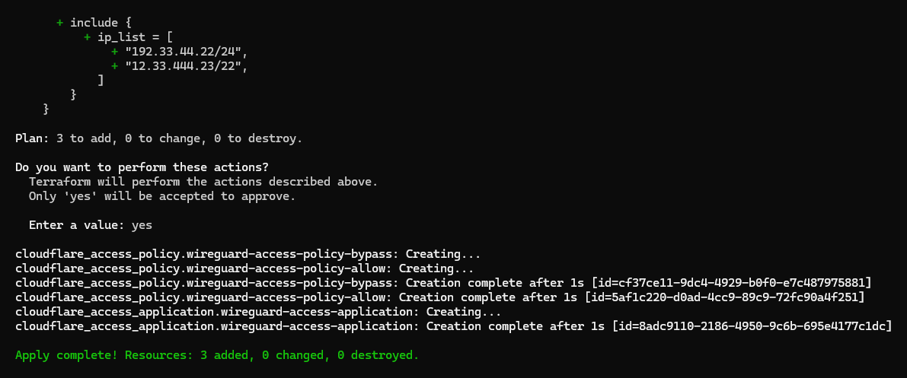

## 7. Test the Zero Trust policies

Perfect! Now let's test it by opening `wireguard.novalagung.com`. If you are being directed to the Terraform Zero Trust access form, it means the Zero Trust policy has been installed successfully to the site. 

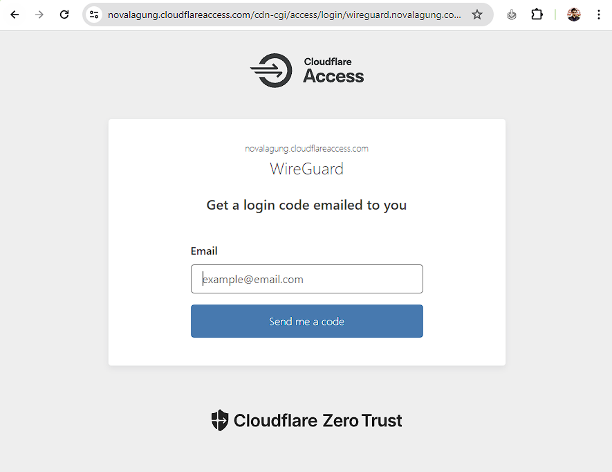

Try to enter with one of the whitelisted emails (in my case it is `hello@novalagung.com`). After that, enter the OTP code or just click the link, either is fine.

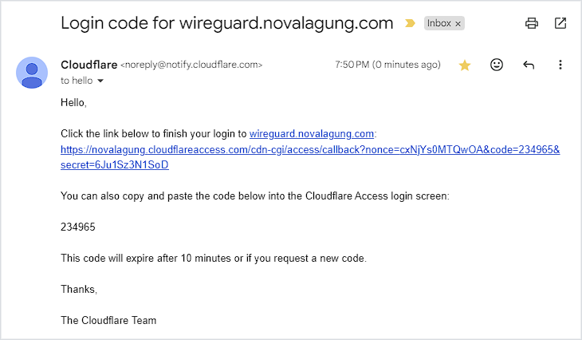

Now you finally have the access to the site. The session will be active for 24 hours.

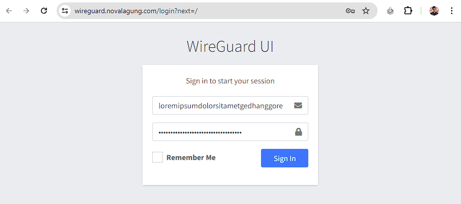
